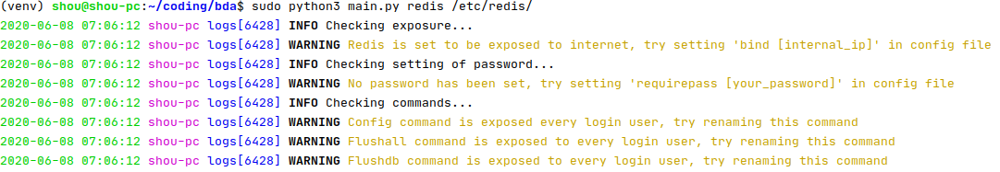

DAudit
==============

By [Shou C](https://github.com/shouc/)




Installation
-----
```
$ git clone https://github.com/shouc/daudit.git && cd daudit
$ python3 -m pip install -r requirements.txt
```


Supported Softwares
-----
NoSQL DB:
* [Redis](#redis)
* [MongoDB](#mongodb)
* CouchDB [TODO]
* Cassandra [TODO]
* HBase [TODO]
* LevelDB [TODO]

Relational DB:
* [MySQL / MariaDB](#mysql--mariadb)
* Postgres [TODO]

Other DB:
* Neo4j [TODO]
* Elasticsearch [TODO]
* InfluxDB [TODO]

Big Data Platform:
* Hadoop [TODO]
* Spark [TODO]

Usage
-----

You can use the following command to print the help message
```
$ python3 main.py -h
usage: main.py [-h] {redis} ...

This is a tool for detecting configuration issues of Redis, MySQL, etc!

positional arguments:
  {redis,mongodb,mysql}
                        commands
    redis               Check configurations of redis
    mongodb             Check configurations of mongodb
    mysql               Check configurations of mysql


optional arguments:
  -h, --help  show this help message and exit
```


Redis
-----
[Advisory](https://redis.io/topics/security)
```
$ python3 main.py redis -h
usage: main.py redis [-h] [--dir DIR]

optional arguments:
  -h, --help  show this help message and exit
  --dir DIR   the dir of redis configuration files, leave blank if you wish the program to automatically detect the location.
```

An example of checking Redis with configuration file /etc/redis/redis.conf
```
$ # both commands are equivalent
$ sudo python3 main.py redis
$ sudo python3 main.py redis --dir /etc/redis 
INFO Evaluating /etc/redis/redis.conf
INFO Checking exposure...
INFO Redis is only exposed to the intranet
INFO Checking setting of password...
WARNING No password has been set, consider setting 'requirepass [your_password]' in config file
INFO Checking commands...
WARNING Config command is exposed to every user, consider renaming this command
WARNING Flushall command is exposed to every user, consider renaming this command
WARNING Flushdb command is exposed to every user, consider renaming this command
```
Checks:
* exposure
* weak/no password
* command renaming

MongoDB
-----
[Advisory](https://docs.mongodb.com/manual/administration/security-checklist/)

```
$ python3 main.py mongodb -h
usage: main.py mongodb [-h] [--dir DIR] [--file FILE]

optional arguments:
  -h, --help   show this help message and exit
  --dir DIR    the dir of configuration files, leave blank if you wish the program to automatically detect it. (e.g. --dir /etc/)
  --file FILE  the name of the configuration file, leave blank if you wish the program to automatically detect it. (e.g. --file xxx.conf)
```

An example of checking MongoDB with configuration file /etc/mongodb.conf
```
$ # both commands are equivalent
$ sudo python3 main.py mongodb
$ sudo python3 main.py mongodb --dir '/etc' --file mongodb.conf 
INFO Evaluating /etc/mongodb.conf
DEBUG Using MongoDB <= 2.4 conf file format (INI)
INFO Checking exposure...
DEBUG The instance is exposed on internal IP: 127.0.0.1
INFO Checking setting of authentication...
WARNING No authorization is enabled in configuration file. Consider set 'auth = true'
INFO Checking code execution issue...
WARNING JS code execution is enabled in configuration file. Consider set 'noscripting = true'
WARNING Object check is not enabled in configuration file. Consider set 'objcheck = true'
```
Checks:
* exposure
* authorization
* js code execution
* object check


MySQL / MariaDB
-----

```
$ python3 main.py mysql -h
usage: main.py mysql [-h] [--password PASSWORD] [--username USERNAME] [--host HOST] [--port PORT]

optional arguments:
  -h, --help           show this help message and exit
  --password PASSWORD  Password of root account []
  --username USERNAME  Username of root account [root]
  --host HOST          Username of root account [127.0.0.1]
  --port PORT          Port of MySQL server [3306]
```

An example of checking MySQL:
```
$ # both commands are equivalent
$ python3 main.py mysql
$ python3 main.py mysql --host "127.0.0.1" --port 3306 --username root --password ""
INFO Checking authentication...
WARNING User na3 is exposed to the internet (0.0.0.0)
INFO Would you like to perform weak-password check? This may create high traffic load for MySQL server. (i.e. Do not perform this when there is already high traffic.)
Type Y/y to perform this action and anything else to skip [Y]x
WARNING User root is exposed to the internet (0.0.0.0)
INFO Would you like to perform weak-password check? This may create high traffic load for MySQL server. (i.e. Do not perform this when there is already high traffic.)
Type Y/y to perform this action and anything else to skip [Y]x
WARNING User shou is exposed to the internet (0.0.0.0)
INFO Would you like to perform weak-password check? This may create high traffic load for MySQL server. (i.e. Do not perform this when there is already high traffic.)
Type Y/y to perform this action and anything else to skip [Y]y
WARNING Weak password 123 set by user shou with host %
INFO Checking obsolete accounts...
DEBUG Obsolete account 'test' is deleted
DEBUG Obsolete account '' is deleted
INFO Checking useless database...
DEBUG All useless DBs are deleted
INFO Checking load file func...
DEBUG --secure-file-priv is enabled
INFO Checking global grants...
WARNING Setting references_priv = N is for user shou with host %
...
DEBUG Skipping privilege checking for root/internal account
INFO Checking database grants...
DEBUG Skipping database privilege checking for root/internal account
```
Checks:
* authentication (exposure + weak password)
* obsolete accounts
* useless database
* load file func
* global grants
* db grants

